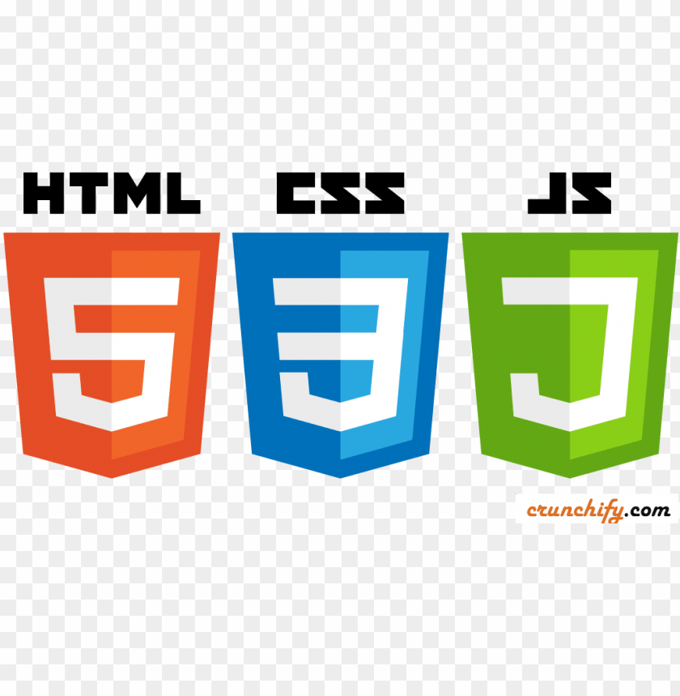
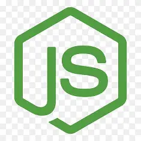
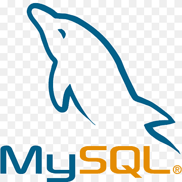

# Project OutLine

## 1. 프로젝트 개요 (Abstract)
- 서비스 명칭: 
- 한 줄 정의: "대덕소프트웨어마이스터고등학교 학생들을 위한 온라인 저지 프로그램"
- 기획 배경: 현재 대덕소프트웨어마이스터고등학교에서 사용하던 백준 온라인 저지 프로그램이 2026년 4월 28일자로 서비스를 종료함에 따라 다른 온라인 저지 프로그램의 필요성을 느낌

## 2. 요구사항 분석 및 기능 정의 (Features)

- 핵심 기능 (MVP): 로그인 & 회원가입, 문제 조회 및 풀기
- 부가 기능: 랭킹, 레벨업 등
- 사용자 요구사항: 코딩 능력 향상

## 3. 기술 스택 (Tech Stack)

- Frontend: HTML / CSS / Javascript
- Backend: Node.js(express 등) 
- Database: MySQL 
- Infrastructure: 호스팅 도구

## 4. 설계 (Design & Architecture)

- 와이어프레임 (Wireframe): 시스템 설계
- 데이터베이스 설계 (ERD): users(사용자) problems(문제), test_cases(테스트 케이스)
- 시스템 아키텍처:
```SYSTEM_ACHITECTER
Javascript에서 API로 정보 요청 -> Node.js에서 반환 -> JavaScript에서 적용
```

## 5. 사용자 흐름 (User Flow)
```USER_FLOW
페이지 접속(홈페이지) -> 회원가입 -> 로그인 -> 문제 목록 -> 문제 상세 페이지 -> 문제 풀기 -> 제출 -> 결과 확인
                                             /\                                               |
                                              |_______________________________________________|
```

## 6. 일정 및 마일스톤 (Timeline)
- 4월 17일: 환경 구축 및 기본 골격 생성
- 4월 18일 ~ 4월 20일: Server, HTML, CSS, JS생성
- 4월 21일 ~ 4월 22일: DB연결 및 로그인 기능 생성
- 4월 23일 ~ 4월 24일: 버그 수정 및 세부 기능 추가
- 4월 25일 ~

# Project Report

1. 프로젝트 개요 (Overview)
서비스 명칭 및 한 줄 정의: 개발한 웹 서비스의 이름과 목적.

개발 배경: 이 서비스를 왜 만들었는지(필요성).

주요 타겟: 누구를 위한 서비스인지.

2. 기술 스택 및 아키텍처 (Tech Stack & Architecture)
사용한 기술: Frontend, Backend, Database, Cloud/Hosting 정보를 아이콘이나 로고와 함께 정리.

시스템 구조도: 사용자-서버-DB 사이의 데이터 흐름을 시각화한 다이어그램.

DB 설계 (ERD): 데이터 테이블 간의 관계도 (이미지 첨부).

3. 핵심 기능 구현 (Key Features)
가장 자신 있는 기능 3~4가지를 선정하여 설명합니다.

주요 화면: 실제 구동되는 서비스 캡처 이미지.

핵심 로직 설명: 단순히 "로그인 구현"이 아니라, "JWT를 활용한 인증 로직"이나 "랭킹 산정 알고리즘" 등 기술적 핵심 내용을 설명.

4. 트러블슈팅 (Troubleshooting) ★가장 중요
개발 중 겪었던 **'삽질'**과 그 **'해결 과정'**을 적는 칸입니다.

문제 발생: 어떤 에러나 성능 저하가 있었는지.

원인 분석: 로그 확인이나 디버깅을 통해 파악한 이유.

해결 방법: 코드를 어떻게 수정했는지, 혹은 어떤 대안을 선택했는지.

결과: 해결 후 개선된 지표나 상태.

5. 프로젝트 결과 및 성과 (Results)
기능 완성도: 기획 대비 구현율 (예: 95% 구현 완료).

성능 지표: 페이지 로딩 속도 최적화 수치나 Lighthouse 점수 등.

배포 주소: 실제 접속 가능한 URL 또는 GitHub Repository 링크.

6. 회고 및 향후 계획 (Retrospective)
배운 점: 새롭게 익힌 기술이나 프로젝트 관리를 통해 느낀 점.

아쉬운 점: 시간이나 기술적 한계로 구현하지 못한 기능.

업데이트 계획: 차기 버전(v2.0)에서 개선할 사항.